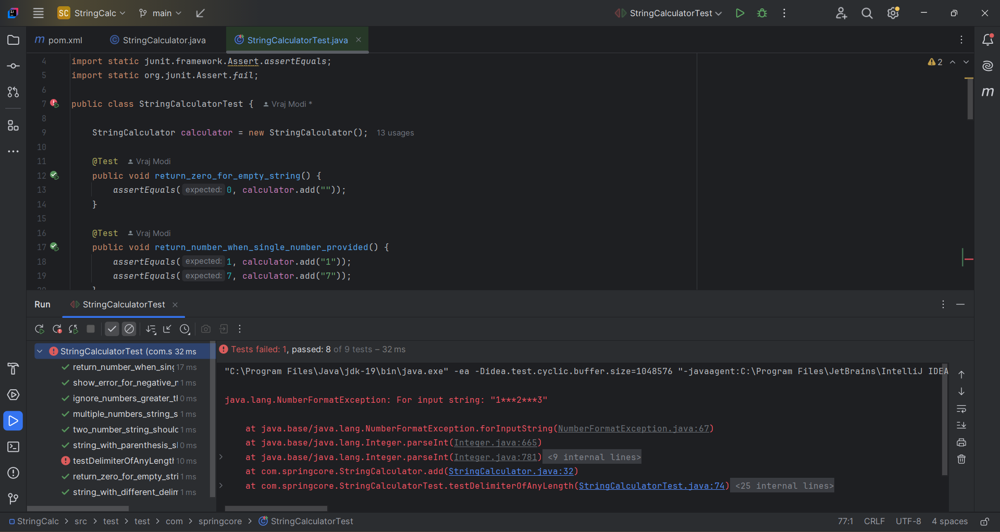
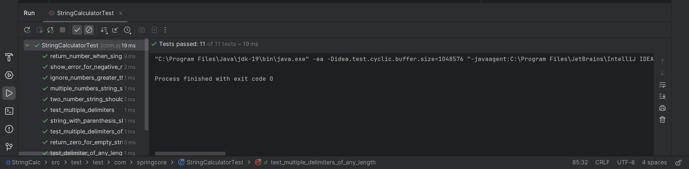

# 📌 **String Calculator (Built with TDD)**

---

## 🧪 **What is This Project?**

This is a **String Calculator** implemented using the **Test-Driven Development (TDD)** approach.

---

## ✅ **What is TDD?**

**TDD (Test-Driven Development)** is a software development practice that helps you build **reliable**, **clean**, and **well-tested** code.

### 🗝️ **The Basic Idea**

1️⃣ **Write a failing test first** — define what the code should do.  
2️⃣ **Write the minimum code needed to pass the test.**  
3️⃣ **Refactor if needed.**  
4️⃣ Repeat!

### 📌 **Key Principles of TDD**

- **Red ➜ Green ➜ Refactor**  
  Always write tests that fail first (**Red**), make them pass (**Green**), then clean up (**Refactor**).

- **Small Steps**  
  Add functionality incrementally.

- **Better Design**  
  TDD leads to simpler, modular, and testable code.

---

## 🗂️ **Features Covered Using TDD**

These are the cases I covered step-by-step:

- ✅ **Empty string returns 0**
- ✅ **Single number returns itself** — `"1"` ➜ `1`
- ✅ **Two numbers, comma-delimited** — `"1,2"` ➜ `3`
- ✅ **Two numbers, newline-delimited** — `"1\n2"` ➜ `3`
- ✅ **Mixed delimiters (comma & newline)** — `"1\n2,3"` ➜ `6`
- ✅ **Custom single-character delimiter** — `"//;\n1;2"` ➜ `3`
- ✅ **Custom delimiter of any length** — `"//[***]\n1***2***3"` ➜ `6`
- ✅ **Multiple delimiters** — `"//[*][%]\n1*2%3"` ➜ `6`
- ✅ **Multiple delimiters of any length (even longer than one char)** — `"//[***][%%]\n1***2%%3"` ➜ `6`
- ✅ **Negative numbers throw exception** — `"1,-2"` ➜ Exception with message `negative numbers not allowed: -2`
- ✅ **Ignore numbers greater than 1000** — `"2,1001"` ➜ `2`

---

## 🧑‍💻 **TDD Workflow Example**

**For each feature:**

1️⃣ Write a test for the new requirement (which fails at first)  
2️⃣ Observe the test error output  
3️⃣ Implement just enough code to make the test pass  
4️⃣ Rerun the test and verify it passes  
5️⃣ Refactor if needed, then move on to the next feature

---

## 📸 **Screenshots**

### 🔴 **Failing Test Example**

---

### ✅ **Passing Test Example**

---

### 🎉 **All Tests Passing**

---

## ✨ **What I Learned**

- How to use TDD to tackle requirements step-by-step
- How to write better unit tests
- How to handle edge cases incrementally
- How TDD improves confidence and code quality

---

## 🚀 **How to Run**

1️⃣ Clone this repo  
2️⃣ Open it in your IDE  
3️⃣ Run the test class (e.g., using JUnit) to verify all test cases pass

---

## 🏆 **Final Note**

✅ **All test cases pass successfully!**  
Feel free to fork this repo, extend it, and use it to sharpen your TDD skills! 🚀
